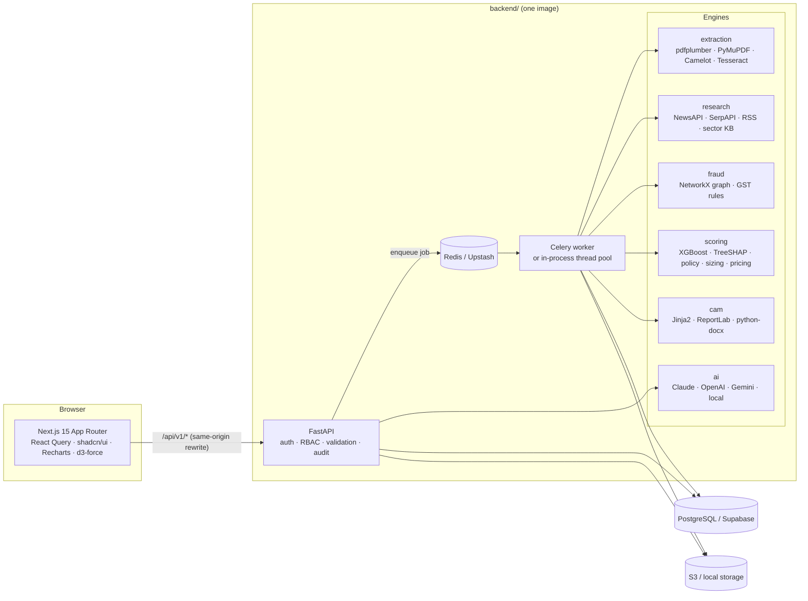
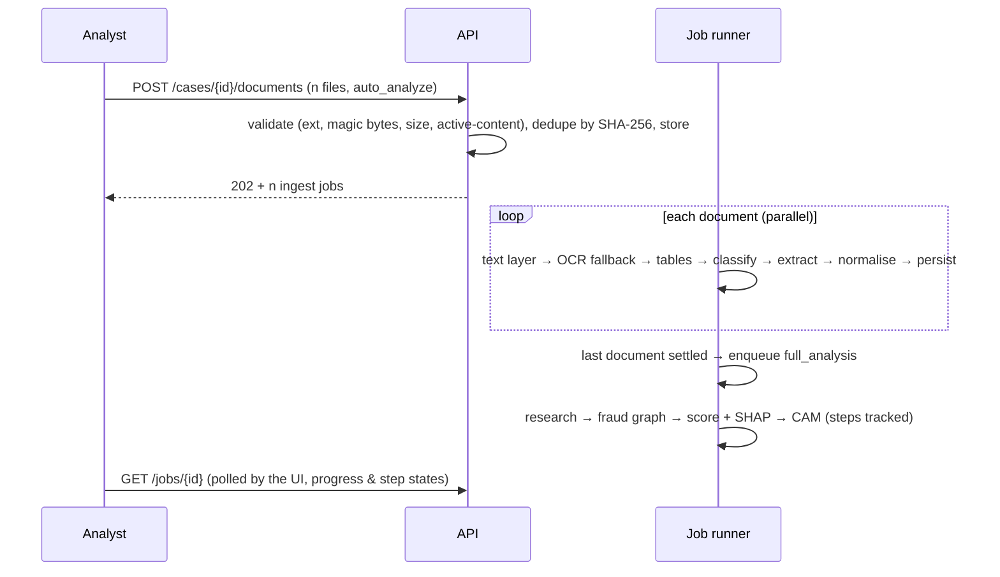
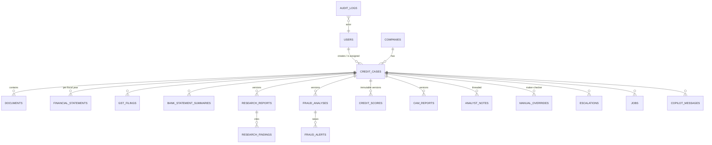

# Architecture overview

CredX is a **modular monolith**: one FastAPI codebase organised by business domain, deployed as two
processes (API + Celery worker) from a single Docker image, plus a Next.js frontend. This keeps the
operational surface of a hackathon project while preserving the seams needed to split services later.

## Layering inside `backend/`

| Layer | Responsibility | Depends on |
|---|---|---|
| `api/` | HTTP contracts, auth guards, request validation, audit calls | services, schemas |
| `services/` | Use-case orchestration: case context assembly, job handlers, audit | engines, models |
| `workers/` | Job execution (status, progress, retries, metrics) and dispatch strategy | services |
| `extraction/ research/ fraud/ scoring/ cam/ ai/` | **Pure domain engines** — functions of their inputs, no DB access | config, utils |
| `models/ database/` | SQLAlchemy 2.0 models, sessions, migrations, seed | — |
| `core/ config/ utils/ middleware/` | Settings, logging, errors, security, cache, retry, metrics, storage, India utils | — |

The engines never touch the database, so they run identically inside a request, a thread, a Celery
worker or a unit test. `services/case_context.py` is the single place that turns database rows into
the dictionaries the engines consume.

## Async pipeline

`JOB_BACKEND` selects the dispatcher: `celery` (Redis broker, prefork workers — production),
`thread` (in-process pool, zero infrastructure — demos and free tiers) or `inline` (tests). Native
PDF libraries are not thread-safe, so all PDF work holds a process-wide lock (`extraction/parsers/pdf.py`);
Celery's process isolation makes this a no-op in production.

## Data model

Twenty tables, UUID keys, `created_at/updated_at` everywhere, enums stored as strings (no `ALTER TYPE`
migrations), JSON columns (`JSONB` on Postgres) for engine payloads. Every engine output is
**versioned and append-only** (scores, research, fraud, CAMs) so a credit committee can always see
what the analyst saw when they decided. Migrations live in `backend/alembic/`; CI asserts
`alembic check` (models and migrations never drift).

## Key decisions

| Decision | Why |
|---|---|
| Modular monolith, not microservices | One deploy unit + one worker. Domains are packages with clean boundaries, so extracting e.g. `extraction` into its own service is a move, not a rewrite. |
| Sync SQLAlchemy 2.0 | Same code path for API routes (FastAPI threadpool) and Celery tasks; async adds complexity with no throughput benefit for a CPU-bound OCR/ML workload. |
| XGBoost + native TreeSHAP | Exact Shapley values from the booster (`pred_contribs`) — no `shap`/pandas at serving time, millisecond explanations. |
| PDO-scaled scores | Log-odds → points is linear, so SHAP values convert to *exact* score points; the waterfall always reconciles. |
| Overlays, not retraining, for qualitative evidence | Analyst notes and unmodelled red flags adjust the score as bounded, cited overlays — visible, reversible, auditable. |
| NetworkX now, Neo4j-ready | Graph built with a Neo4j-compatible property model; `GraphStore` interface + Cypher export make migration mechanical. |
| Local grounded LLM fallback | The copilot works offline and never invents numbers; real LLMs are an upgrade, not a dependency. |
| Same-origin API via Next rewrites | No CORS in the browser, secure cookies possible later, and Vercel → Railway/Render wiring is one env var. |
